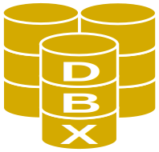

 

# DataBaseX

 Repósitorio onde estão disponíveis scripts para criação de bancos de dados e inserção de dados para testes, estudos e projetos. Alguns nomes dos bancos são referências aos projetos publicados neste perfil nos quais são utilizados.

 ## Tecnologias

- MySQL

## Lista de Bancos

- db_crudx.sql - script MySQL do banco de dados utilizado nos projetos [CrudX](https://github.com/emso-exe/CrudX) e [SyntheticX](https://github.com/emso-exe/SyntheticX).
    - tabelas: setor, cargo, perfil, status, usuario e login.
    - insert_db_crudx.sql: script com registros para inserção no banco para testes.

## Créditos

- [Estênio Mariano](https://github.com/emso-exe)

## Licença

Licença MIT (MIT). Por favor leia o [arquivo da licença](LICENSE) para mais informações.
